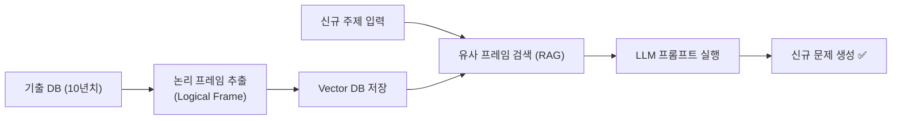
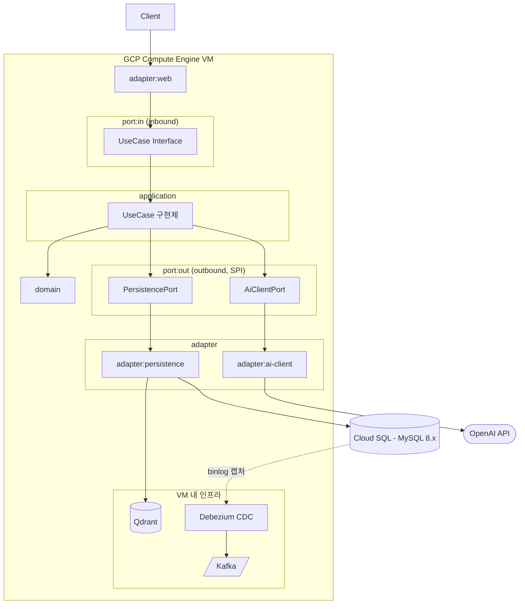

# 🧠 PSAT 언어논리 AI 문제생성 백엔드

> AI 기반 5급 공무원 공개경쟁채용시험 (PSAT) 언어논리 영역 문제 자동 생성 서비스의 백엔드 레포지토리입니다.  
> 10년치 기출 DB에서 **논리적 프레임(Logical Frame)** 을 추출하고, 신규 주제를 주입하여 고품질 모의고사 문제를 생성합니다.

---

## 📌 목차

- [서비스 개요](#서비스-개요)
- [기술 스택](#기술-스택)
- [아키텍처](#아키텍처)
    - [멀티모듈 + 헥사고날 아키텍처](#멀티모듈--헥사고날-아키텍처)
    - [배포 구조](#배포-구조)
- [로컬 환경 설정](#로컬-환경-설정)
- [빌드 및 실행](#빌드-및-실행)
- [커밋 컨벤션](#커밋-컨벤션)
- [브랜치 전략](#브랜치-전략)
- [API 문서](#api-문서)

---

## 서비스 개요

### 핵심 전략: RAG 기반 문제 생성



- **RAG (Retrieval-Augmented Generation)**: 기출 문제의 구조·논리 패턴을 벡터화하여 유사 프레임을 검색, LLM에 컨텍스트로 주입
- **품질 보장**: 실제 PSAT 출제 경향을 학습한 데이터 기반으로 문체와 논리 구조를 유지

---

## 기술 스택

| 구분 | 기술 |
|------|------|
| Language | Kotlin 2.3.x |
| Runtime | JVM 25 |
| Framework | Spring Boot 4.x.x |
| Build | Gradle 9.x |
| Database | MySQL 8.x |
| Vector DB | Qdrant |
| Concurrency | Kotlin Coroutines |
| AI | Anthropic Claude API / OpenAI API |
| Infra | Docker, Docker Compose / GCP Compute Engine |

---

## 아키텍처

### 멀티모듈 + 헥사고날 아키텍처

도메인별로 모듈을 분리하고, 각 도메인 내부는 헥사고날(포트-어댑터) 구조를 따릅니다.

```
root/
├── shared/
│   ├── kernel/                  # 순수 Kotlin. 공통 VO, Domain Event, 자체 검증 로직. Spring/외부 라이브러리 의존 금지
│   └── infra/                   # 공통 기술 도구 (JPA, Messaging, Web 등)
│
├── {domain}/                    # question, question-generation, exam, exam-attempt, token-usage 등
│   ├── domain/                  # 순수 비즈니스 엔티티/규칙. 외부 의존성 없음
│   ├── application/
│   │   └── service/             # UseCase 구현체
│   ├── port/
│   │   ├── inbound/             # Inbound Port (UseCase 인터페이스)
│   │   ├── outbound/            # Outbound Port (SPI: DB, AI, 외부 API 등)
│   └── adapter/
│       ├── web/                 # Inbound Adapter. port/inbound 호출
│       ├── persistence/         # Outbound Adapter. port/outbound 구현 (JPA, Vector Search)
│       └── {technology}/        # 도메인별 필요에 따라 추가되는 여타 외부 기술 어댑터 (예: ai-client)
│
└── bootstrap/                   # 진입점. DI 및 설정 담당
```

**의존 방향 및 설계 규칙**

- **의존 흐름**: `Adapter → Application (Port) → Domain`
- **의존성 강제**: 멀티모듈 구조로, 꼭 필요한 모듈만 gradle 의존성으로 추가하여 사용합니다.
- **Port 위치**: DB, AI API, 파일 시스템 등 모든 외부 연동은 반드시 `{domain}:port:outbound`에 인터페이스로 정의합니다.
- **레이어 격리**: JPA Entity(영속성 계층)나 Request/Response DTO(웹 계층)가 `application`, `domain` 레이어로 새어 들어가지 않도록 하며, 계층 간 변환은 Mapper를 사용합니다.
- **RAG 파이프라인 책임 분리**:
    - `application`: 포트를 통해 RAG 흐름(프레임 검색 → 프롬프트 생성 → 문제 생성 → 저장)을 조율
    - `adapter:persistence`: 벡터 유사도 검색 수행
    - `adapter:ai-client`: 실제 LLM 프롬프트 실행 담당
- **신규 기능 구현 순서**: 항상 `port/outbound`(또는 `port/inbound`) 정의부터 시작합니다.

### 시스템 구조



- **VM**: `adapter:web` ~ `adapter:ai-client`까지 애플리케이션 전체와 Qdrant, Debezium, Kafka가 GCP Compute Engine VM 한 대에 배치됩니다.
- **Cloud SQL**: MySQL 8.x는 관리형 서비스(Cloud SQL)로 분리되어 있으며, binlog 캡처를 통해 Debezium이 CDC 이벤트를 Kafka로 발행합니다.
- **AI 연동**: `adapter:ai-client`가 외부 OpenAI API를 호출합니다.

---

## 로컬 환경 설정

### Prerequisites

- JDK 25+
- Docker & Docker Compose
- Gradle 9.x

### 인프라 실행 (Docker Compose)

```bash
docker compose -f docker/docker-compose.dev.yml up -d
```

실행되는 서비스: 메인 서버, MySQL 8, Vector DB

### 환경변수 설정

```bash
cp .env.example .env
# .env 파일을 열어 필요한 값 입력 (아래 환경변수 섹션 참고)
```

---

## 빌드

```bash
# 전체 빌드
./gradlew build

# 테스트 제외 빌드
./gradlew build -x test
```

---

## 커밋 컨벤션

### 형식

```
<type>(<scope>): <subject>

[optional body]

[optional footer]
```

### Type 목록

| Type | 설명 |
|------|------|
| `feat` | 새로운 기능 추가 |
| `fix` | 버그 수정 |
| `docs` | 문서 수정 (README, 주석 등) |
| `style` | 코드 포맷팅, 세미콜론 누락 등 (로직 변경 없음) |
| `refactor` | 리팩토링 (기능 변경 없음) |
| `test` | 테스트 코드 추가 및 수정 |
| `chore` | 빌드 설정, 의존성 업데이트 등 |
| `perf` | 성능 개선 |
| `ci` | CI/CD 설정 변경 |

### Scope (선택)

모듈 또는 도메인 단위로 작성합니다.  
예: `question`, `auth`, `shared`, `member`, `bootstrap`

### 예시

```bash
feat(question): 기출 논리 프레임 벡터화 저장 기능 추가

RAG 파이프라인의 첫 단계로, 기출 문제에서 추출한 논리 프레임을
Vector DB에 저장하는 Port와 Adapter를 구현합니다.

Resolves: #42
```

```bash
fix(ai-client): 토큰 초과 시 프롬프트 잘림 오류 수정
refactor(question): QuestionGenerationService 메서드 분리
docs: 로컬 환경 설정 가이드 업데이트
```

---

## 브랜치 전략

`main` → `develop` → `feature/*` / `fix/*` / `refactor/*`

| 브랜치               | 설명 |
|-------------------|------|
| `main`            | 프로덕션 배포 브랜치. 직접 푸시 금지 |
| `develop`         | 통합 개발 브랜치. PR을 통해서만 머지 |
| `feature/{scope}` | 기능 개발 브랜치 |
| `fix/{scope}`      | 버그 수정 브랜치 |
| `refactor/{scope}` | 리팩토링 브랜치 |

```bash
# 예시
git checkout -b feature/auth
git checkout -b fix/question
```

---

## API 문서

로컬 서버 실행 후 아래 URL에서 Swagger UI를 확인할 수 있습니다.

```
http://localhost:8080/swagger-ui.html
```